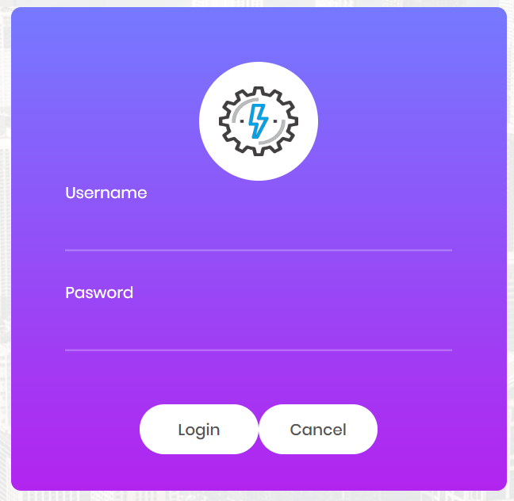
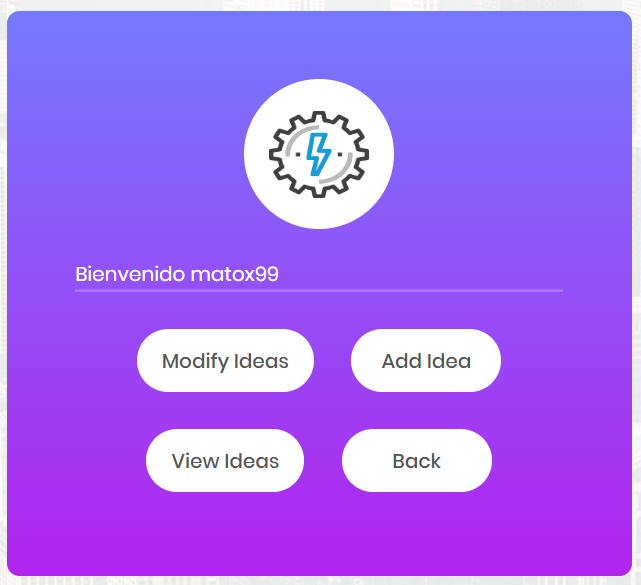
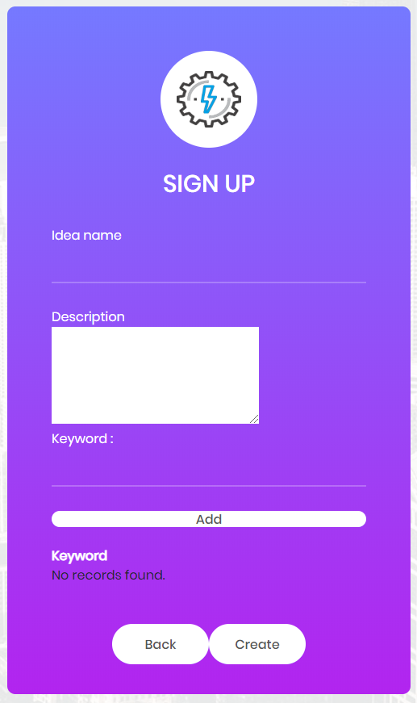
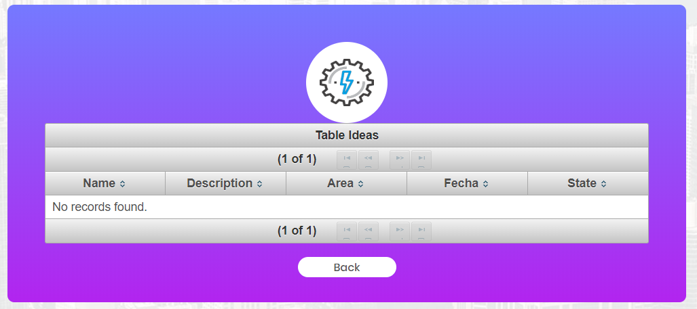
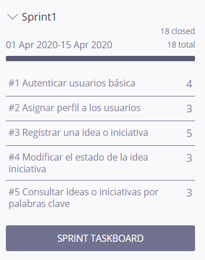
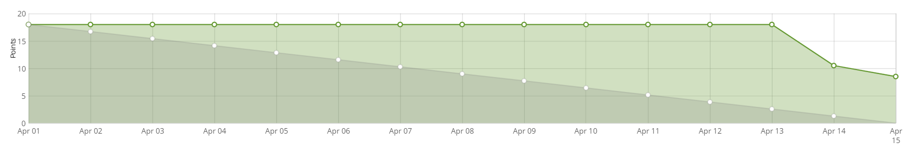
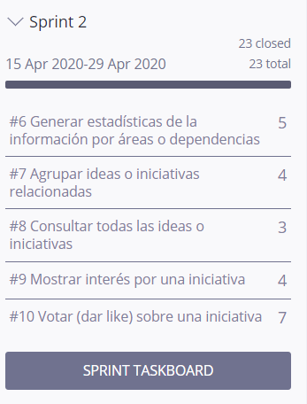
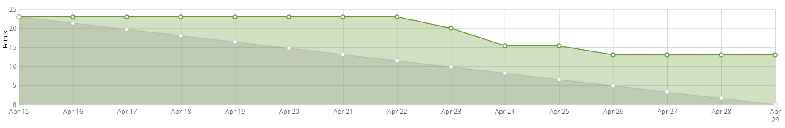
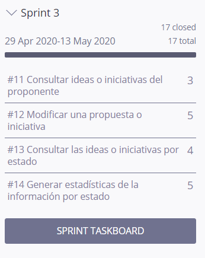
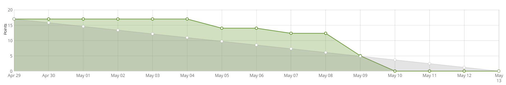

# PROYECTO CVDS RamioSquad

Este proyecto es la culminación de nuestro curso de nuestro curso de ciclos de vida del desarrollo del software. El cual consiste en una herramienta donde se pueden registrar, consultar o modificar, iniciativas e ideas de proyectos para la Escuela. En la herramienta pueden interactuar diferentes actores donde cada uno de ellos tiene diferentes habilidades. 


## Equipo

#### Dueño del proyecto
* Oscar David Ospina Rodríguez

Docente de la materia y graduado Ingeniero de Sistemas de la Escuela Colombiana de Ingeniería Julio Garavito.

#### Scrum master
* Juan Sebastián Ramos Isaza

#### Equipo de Desarrolladores
* Brayan Alexis Jimenez Moya
* Mateo Ernesto Quintero Acevedo
* María Fernanda Hernández Vargas

Estudiantes de la Escuela Colombiana de Ingeniería Julio Garavito de la carrera de ingeniería de sistemas, cursan el septimo semestre.

## Manual del usuario

### Login



En la pagina web hay roles, cada uno con diferentes caracteristicas.

```
- Administrador
- Personal PMO - ODI
- Proponente de iniciativa o idea de proyecto
- Usuarios de consulta
```

### Administrador 


### Personal PMO - ODI

### Proponente de iniciativa o idea de proyecto



* Agregar Idea



* Modificar Idea


* Ver Idea



### Usuarios de consulta


## Arquitectura y Diseño

### Modelo E-R.
### Diagrama de clases (hacerlo mediante ingeniería inversa)

```
Give the example
```

## Descripción del Proyecto

### Breve descripción de la Metodología.
### Generar el 'release-burndown chart' del proyecto, e indicar los puntos de
historia realizados y los faltantes.

### Sprint 1




### Sprint 2




### Sprint 3





### Reporte de pruebas y de cubrimiento de las mismas (sólo la foto del reporte
principal). Para la cobertura, pueden usar los plugins disponibles (EclEmma,
Jacoco, etc.)
### Reporte de análisis estático de código. Se pueden usar las mismas
herramientas trabajadas en los laboratorios.


## Construido con

* [Primefaces](https://www.primefaces.org/)
* [Maven](https://mvnrepository.com/)
* Enlace al sistema de integración continua.


## Herramientas

* [Taiga](https://tree.taiga.io/project/jsr25-plataforma-banco-de-iniciativas-de-proyectos/backlog) 
* [Heroku](https://gist.github.com/PurpleBooth/b24679402957c63ec426) 


## Autores

* **Juan Sebastián Ramos Isaza** - [GitHub](https://github.com/jsr25)
* **Brayan Alexis Jimenez Moya** - [GitHub](https://github.com/BJM19)
* **Mateo Ernesto Quintero Acevedo** - [GitHub](https://github.com/mateo9931)
* **María Fernanda Hernández Vargas** - [GitHub](https://github.com/mariahv9)


## Conocimientos

* Java
* Primefaces
* Maven
