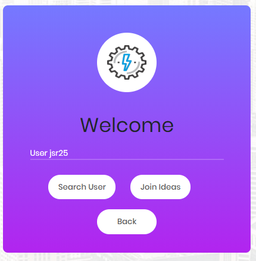
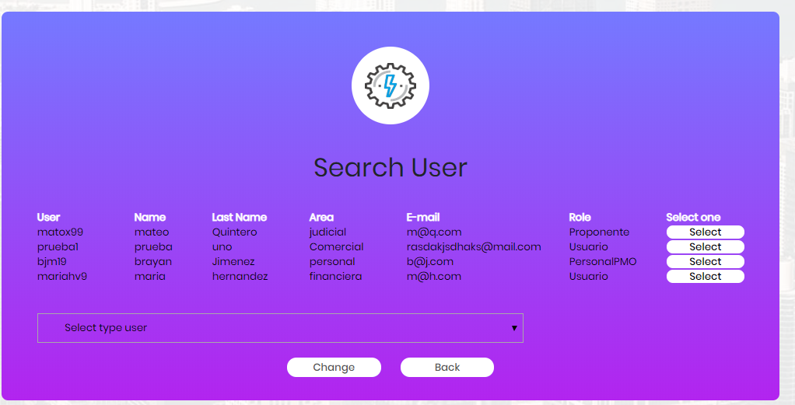
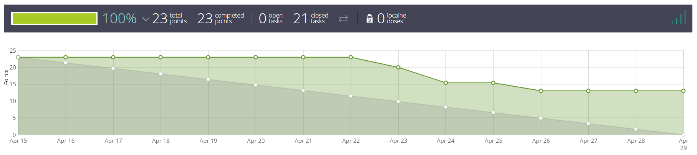

# PROYECTO CVDS RamioSquad

Este proyecto es la culminación de nuestro curso de ciclos de vida del desarrollo del software. El cual es una herramienta donde se pueden registrar, consultar o modificar, iniciativas e ideas de proyectos para la Escuela. En la herramienta pueden interactuar diferentes actores donde cada uno de ellos tiene opciones.


## Equipo

#### Dueño del proyecto
* Oscar David Ospina Rodríguez

Docente de la materia y graduado Ingeniero de Sistemas de la Escuela Colombiana de Ingeniería Julio Garavito.

#### Scrum master
* Juan Sebastián Ramos Isaza

#### Equipo de Desarrolladores
* Brayan Alexis Jimenez Moya
* Mateo Ernesto Quintero Acevedo
* María Fernanda Hernández Vargas

Estudiantes de la Escuela Colombiana de Ingeniería Julio Garavito de la carrera de ingeniería de sistemas, cursan el septimo semestre.

## Manual del usuario

### Login


### Sign Up


### Registro Exitoso


En la pagina web hay roles, cada uno con diferentes caracteristicas.

```
- Administrador
- Personal PMO - ODI
- Proponente de iniciativa o idea de proyecto
- Usuarios de consulta
```

### Administrador 



Este rol tiene las características de:

```
- Buscar idea
- Estado idea
- Agrupar idea
```
* Buscar idea



* Estado idea


* Agrupar idea


### Personal PMO - ODI


Este rol tiene las características de:

```
- Cambiar el estado de las ideas.
```
* Cambiar el estado de las ideas.


### Proponente de iniciativa o idea de proyecto


Este rol tiene las características de:

```
- Ver ideas
- Modificar idea
- Registrar idea
```

* Ver ideas


* Modificar idea


* Registrar idea


### Usuarios de consulta


Este rol tiene las características de:

```
- Consultar ideas por palabra clave
- Ver estadísticas de las ideas
- Consultar tabla de ideas registradas
- Consultar estado de las ideas
- Consultar y agregar comentario a las ideas
```

* Consultar ideas por palabra clave


* Ver estadísticas de las ideas


* Consultar tabla de ideas registradas


* Consultar estado de las ideas


* Consultar y agregar comentario a las ideas


## Arquitectura y Diseño

#### Modelo E-R.


#### Diagrama de clases (hacerlo mediante ingeniería inversa)

### Sprint 1


### Sprint 2




### Sprint 3


## Construido con

* [Primefaces](https://www.primefaces.org/)
* [Maven](https://mvnrepository.com/)

## Herramientas

* [Taiga](https://tree.taiga.io/project/jsr25-plataforma-banco-de-iniciativas-de-proyectos/backlog) 
* [Heroku](https://proyecto-cvds-2020-1.herokuapp.com/) 

## Autores

* **Juan Sebastián Ramos Isaza** - [GitHub](https://github.com/jsr25)
* **Brayan Alexis Jimenez Moya** - [GitHub](https://github.com/BJM19)
* **Mateo Ernesto Quintero Acevedo** - [GitHub](https://github.com/mateo9931)
* **María Fernanda Hernández Vargas** - [GitHub](https://github.com/mariahv9)


## Conocimientos

* Java
* Primefaces
* Maven
